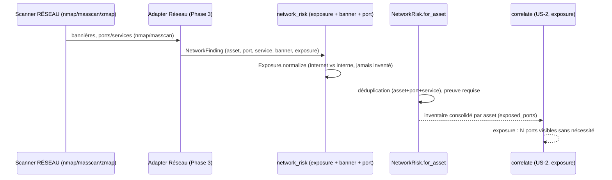

# SEC-11 — network_risk : exposition réseau (ports/services, contexte 12)

Le contexte `network_risk` normalise l'exposition réseau (ports ouverts,
services, bannières) en `NetworkFinding` classés par exposition Internet
(`Exposure`), et consolide l'inventaire par asset. Il alimente la corrélation
`exposure` (« N ports visibles sans nécessité ») et permet au rapport de
signaler ce qui est réellement exposé.

## Key Points

- `Exposure` n'a que `INTERNET_EXPOSED` / `INTERNAL_ONLY` ; `is_exposed()`
  décide de la visibilité depuis l'extérieur. `normalize()` **rejette** toute
  valeur inconnue — jamais d'invention.
- `Port` et `Application` sont **réutilisés** d'`asset_inventory` (DRY,
  contexte 5) : le champ `service` reste le langage ubiquitaire.
- **Preuve obligatoire** : un `NetworkFinding` sans bannière est écarté de
  l'inventaire (spéculation rejetée), conformément à la règle « pas de
  corrélation sans preuve ».
- `NetworkRisk.for_asset` ne lève **jamais** : aucun finding → inventaire vide
  (pas un échec) ; déduplication par (asset, port, service).
- Consommé par `correlate` (US-2, `exposure`) ; le mandat (consent) reste
  obligatoire pour tout scan.

## Test Coverage

| Fichier | Couverture de branches |
|---|---|
| `domain/network_risk/exposure.py` | 100 % |
| `domain/network_risk/banner.py` | 100 % |
| `domain/network_risk/network_finding.py` | 100 % |
| `domain/network_risk/network_risk.py` | 100 % |

## Related Files

- `src/hexa_sec/domain/network_risk/network_risk.py` — l'agrégat `for_asset`
- `src/hexa_sec/domain/network_risk/network_finding.py` — le VO `NetworkFinding`
- `src/hexa_sec/domain/network_risk/exposure.py` — l'enum `Exposure`
- `src/hexa_sec/domain/network_risk/banner.py` — le VO `Banner`
- `src/hexa_sec/domain/asset_inventory/port.py` — `Port`/`Application` (réutilisés)
- `tests/unit/domain/test_network_risk.py` — scénarios d'inventaire et edge cases
