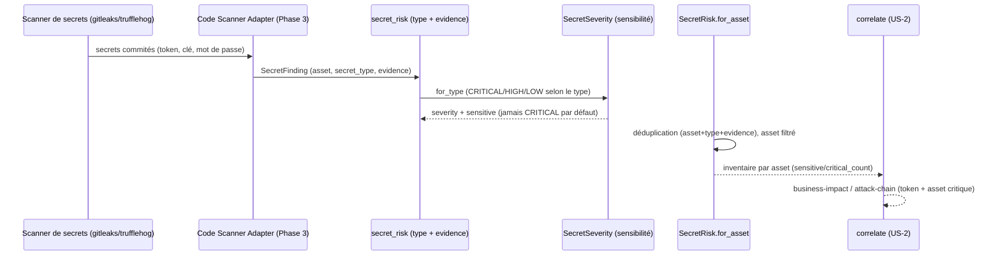

# SEC-12 — secret_risk : les secrets commités (contexte 13)

Le contexte `secret_risk` normalise les secrets commités (token, clé API, mot de
passe) en `SecretFinding` classés par `SecretType`, avec une `SecretSeverity`
dérivée de la sensibilité du type. Il alimente la corrélation `business-impact`
(un credential exposé sur un asset critique) et permet au rapport de dire
« révoquez cette clé » avec une preuve. Le domaine reste pur : zéro import
scanner/adapter/SDK.

## Key Points

- `SecretType` n'a que les familles courantes (APIKEY, PRIVATEKEY, PASSWORD,
  TOKEN, AWSKEY, CIPHERTEXT) ; `normalize()` **rejette** la valeur inconnue —
  jamais d'invention ni de supposition.
- `SecretSeverity` est **dérivée du type** : PRIVATEKEY/AWSKEY/PASSWORD → CRITICAL,
  TOKEN/APIKEY → HIGH, CIPHERTEXT → LOW. Un type banal n'est **jamais** CRITICAL
  par défaut.
- **Preuve obligatoire** : un `SecretFinding` sans evidence est rejeté à la
  construction (pas de spéculation).
- `SecretRisk.for_asset` filtre par asset, déduplique (asset+type+evidence),
  **garde** les findings marqués `revoked` (tracés, jamais supprimés
  silencieusement) et ne lève jamais si aucun secret n'est détecté.
- Consommé par `correlate` (business-impact / attack-chain) ; le mandat
  (consent) reste obligatoire pour tout scan.

## Test Coverage

| Fichier | Couverture de branches |
|---|---|
| `domain/secret_risk/secret_type.py` | 100 % |
| `domain/secret_risk/secret_severity.py` | 100 % |
| `domain/secret_risk/secret_finding.py` | 100 % |
| `domain/secret_risk/secret_risk.py` | 100 % |

## Related Files

- `src/hexa_sec/domain/secret_risk/secret_risk.py` — l'agrégat `for_asset`
- `src/hexa_sec/domain/secret_risk/secret_finding.py` — le VO `SecretFinding`
- `src/hexa_sec/domain/secret_risk/secret_severity.py` — le VO `SecretSeverity`
- `src/hexa_sec/domain/secret_risk/secret_type.py` — l'enum `SecretType`
- `src/hexa_sec/domain/finding/severity.py` — `Severity` (réutilisé, DRY)
- `tests/unit/domain/test_secret_risk.py` — scénarios d'inventaire et edge cases
