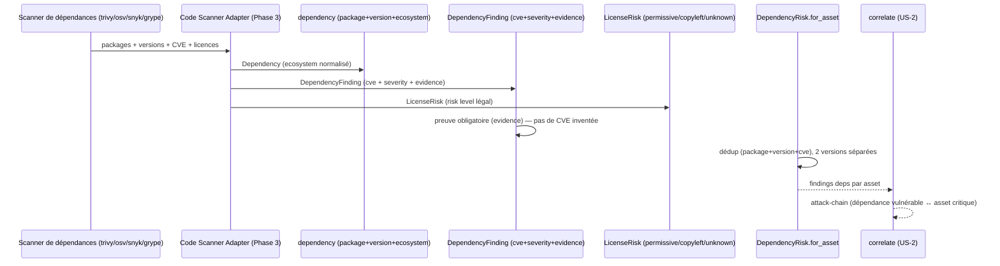

# SEC-13 — dependency_risk : dépendances & licences (contexte 14)

Le contexte `dependency_risk` normalise les dépendances (package + version +
écosystème) et le risque (CVE de `DependencyFinding`, obligation légale de
`LicenseRisk`). Il alimente la corrélation `attack-chain` (dépendance vulnérable
sur un asset critique) et permet au rapport de dire « passez sur Express 4.18 ».
Le domaine reste pur : zéro import scanner/adapter/SDK.

## Key Points

- `Ecosystem` n'a que les familles connues (npm, pypi, maven, gem, cargo,
  golang) ; `normalize()` **rejette** la valeur inconnue — jamais devinée.
- `Dependency` exige `package` non vide, `version` non vide, `ecosystem`
  valide ; une version « inconnue » est un marqueur non vide (ex. `"unknown"`),
  tracée, jamais refusée.
- `DependencyFinding` exige une **preuve** (`evidence`) : une CVE sans preuve est
  rejetée à la construction — pas de vulnérabilité inventée.
- `LicenseRisk` : MIT/Apache/BSD → PERMISSIVE (faible) ; GPL/AGPL/LGPL → COPYLEFT
  (élevé) ; licence inconnue ou absente → **UNKNOWN explicite**, jamais supposée.
- `DependencyRisk.for_asset` déduplique par (package, version, cve) — deux
  versions du même package restent **séparées** (jamais fusionnées) — et ne lève
  jamais si aucune dépendance vulnérable n'est détectée.
- Consommé par `correlate` (attack-chain) ; le mandat (consent) reste obligatoire.

## Test Coverage

| Fichier | Couverture de branches |
|---|---|
| `domain/dependency_risk/ecosystem.py` | 100 % |
| `domain/dependency_risk/dependency.py` | 100 % |
| `domain/dependency_risk/license_risk.py` | 100 % |
| `domain/dependency_risk/dependency_risk.py` | 100 % |

## Related Files

- `src/hexa_sec/domain/dependency_risk/dependency_risk.py` — l'agrégat `for_asset`
- `src/hexa_sec/domain/dependency_risk/dependency.py` — `Dependency` + `DependencyFinding`
- `src/hexa_sec/domain/dependency_risk/license_risk.py` — `License`/`LicenseRiskLevel`/`LicenseRisk`
- `src/hexa_sec/domain/dependency_risk/ecosystem.py` — l'enum `Ecosystem`
- `src/hexa_sec/domain/finding/severity.py` — `Severity` (réutilisé, DRY)
- `tests/unit/domain/test_dependency_risk.py` — scénarios d'inventaire et edge cases
