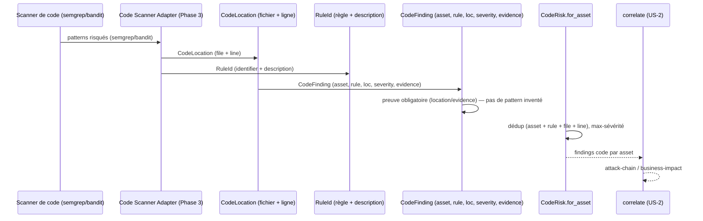

# SEC-14 — code_risk : le code statique (contexte 15)

Le contexte `code_risk` normalise les findings de code statique (patterns
dangereux, fonctions non sûres) en `CodeFinding` classés par `RuleId` (contrat de
la règle semgrep/bandit) avec une `Severity`. Il alimente la corrélation
`attack-chain` (pattern risqué sur un asset critique) et permet au rapport de
dire « corrige ce pattern ici » avec la règle comme preuve. Le domaine reste pur :
zéro import scanner/adapter/SDK.

## Key Points

- `RuleId` est le **contrat** : `identifier` (ex. `bandit.B101`) + `description`
  courte, tous deux non vides — la règle exacte, jamais supposée.
- `CodeLocation` (file + line, `line >= 1`) est la preuve du pattern.
- `CodeFinding` exige une **preuve** (`location` + `evidence`) : sans preuve,
  aucun finding — pas de pattern inventé.
- `CodeRisk.for_asset` déduplique par (asset, rule, file, line) — deux locations
  de la même règle restent **séparées** ; chaque asset est isolé ; sur doublon la
  **sévérité max** gagne (déterminisme indépendant de l'ordre) ; un pattern bénin
  (sévérité basse) est conservé, jamais supprimé silencieusement.
- Consommé par `correlate` (attack-chain) ; le mandat (consent) reste obligatoire.

## Test Coverage

| Fichier | Couverture de branches |
|---|---|
| `domain/code_risk/rule_id.py` | 100 % |
| `domain/code_risk/code_location.py` | 100 % |
| `domain/code_risk/code_finding.py` | 100 % |
| `domain/code_risk/code_risk.py` | 100 % |

## Related Files

- `src/hexa_sec/domain/code_risk/code_risk.py` — l'agrégat `for_asset`
- `src/hexa_sec/domain/code_risk/code_finding.py` — le VO `CodeFinding`
- `src/hexa_sec/domain/code_risk/rule_id.py` — le VO `RuleId`
- `src/hexa_sec/domain/code_risk/code_location.py` — le VO `CodeLocation`
- `src/hexa_sec/domain/finding/severity.py` — `Severity` (réutilisé, DRY)
- `tests/unit/domain/test_code_risk.py` — scénarios d'inventaire et edge cases
