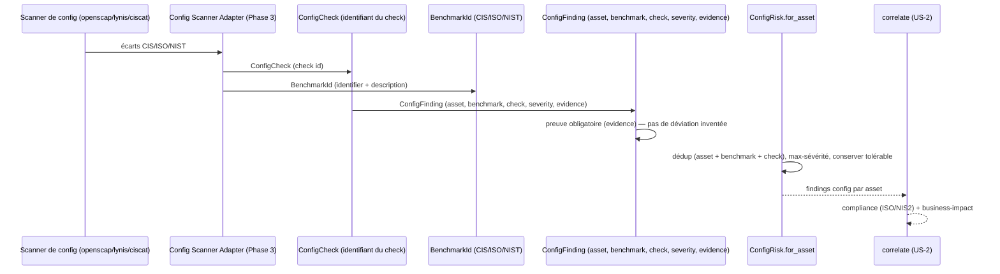

# SEC-15 — config_risk : les benchmarks CIS (contexte 16)

Le contexte `config_risk` normalise les écarts de configuration (déviations CIS,
trous de durcissement) en `ConfigFinding` classés par `BenchmarkId` (CIS, ISO,
NIST) avec une `Severity`. Il alimente la corrélation `compliance`
(score ISO/NIS2) et permet au rapport de dire « vous avez 4 écarts CIS sur ce
serveur ». Le domaine reste pur : zéro import scanner/adapter/SDK.

## Key Points

- `BenchmarkId` est le **contrat** : `identifier` (ex. `cis_ubuntu_22.04`) +
  `description` courte, non vides — l'id exact, jamais deviné.
- `ConfigCheck` (ex. `1.1.1`) identifie le check ; `ConfigFinding` exige une
  **preuve** (`check` + `evidence`) — sans preuve, aucun finding.
- `ConfigRisk.for_asset` déduplique par (asset, benchmark, check) — deux checks
  distincts restent **séparés** ; chaque asset est isolé ; sur doublon la
  **sévérité max** (puis evidence min) gagne — déterminisme indépendant de
  l'ordre ; un écart **tolérable** (sévérité basse) est **conservé**, jamais
  supprimé silencieusement.
- Consommé par `correlate` (compliance) ; le mandat (consent) reste obligatoire.

## Test Coverage

| Fichier | Couverture de branches |
|---|---|
| `domain/config_risk/benchmark_id.py` | 100 % |
| `domain/config_risk/config_check.py` | 100 % |
| `domain/config_risk/config_finding.py` | 100 % |
| `domain/config_risk/config_risk.py` | 100 % |

## Related Files

- `src/hexa_sec/domain/config_risk/config_risk.py` — l'agrégat `for_asset`
- `src/hexa_sec/domain/config_risk/config_finding.py` — le VO `ConfigFinding`
- `src/hexa_sec/domain/config_risk/benchmark_id.py` — le VO `BenchmarkId`
- `src/hexa_sec/domain/config_risk/config_check.py` — le VO `ConfigCheck`
- `src/hexa_sec/domain/finding/severity.py` — `Severity` (réutilisé, DRY)
- `tests/unit/domain/test_config_risk.py` — scénarios d'inventaire et edge cases
