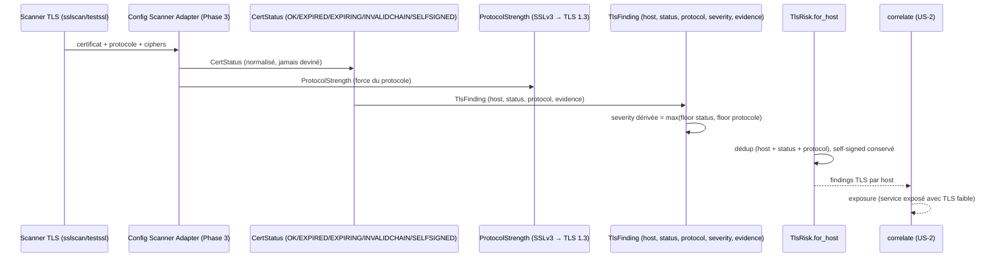

# SEC-16 — tls_risk : les certificats TLS (contexte 17)

Le contexte `tls_risk` normalise les findings TLS (expiration, validité, force
du protocole, cipher) en `TlsFinding` classés par `CertStatus` et
`ProtocolStrength`, avec une `severity` dérivée. Il alimente la corrélation
`exposure` (service exposé avec TLS faible) et permet au rapport de dire « ce
certificat expire dans 3 jours, renouvelez-le ». Le domaine reste pur : zéro
import scanner/adapter/SDK.

## Key Points

- `CertStatus` (OK / EXPIRED / EXPIRING / INVALIDCHAIN / SELFSIGNED) impose un
  floor de sévérité : **EXPIRED/INVALIDCHAIN → CRITICAL** (jamais LOW),
  SELFSIGNED/EXPIRING → MEDIUM, OK → LOW. `normalize()` rejette l'inconnu.
- `ProtocolStrength` (SSLv3 → TLS 1.3) : SSLv3 → CRITICAL, TLS1.0/1.1 → HIGH
  (obsolète), TLS1.2 → MEDIUM, TLS1.3 → LOW ; `of()` rejette l'inconnu.
- `TlsFinding.severity` est **dérivée** = max(floor status, floor protocole) →
  un certificat expiré ou un protocole faible ne peut jamais être LOW.
- `TlsRisk.for_host` déduplique par (host, status, protocol) — deux protocoles
  distincts restent **séparés** ; chaque host est isolé ; un cert **self-signed**
  est **conservé** (toléré, marqué) ; déterministe (evidence min sur doublon) ;
  jamais d'échec si aucun finding.
- Consommé par `correlate` (exposure) ; le mandat (consent) reste obligatoire.

## Test Coverage

| Fichier | Couverture de branches |
|---|---|
| `domain/tls_risk/cert_status.py` | 100 % |
| `domain/tls_risk/protocol_strength.py` | 100 % |
| `domain/tls_risk/tls_finding.py` | 100 % |
| `domain/tls_risk/tls_risk.py` | 100 % |

## Related Files

- `src/hexa_sec/domain/tls_risk/tls_risk.py` — l'agrégat `for_host`
- `src/hexa_sec/domain/tls_risk/tls_finding.py` — le VO `TlsFinding` (severity dérivée)
- `src/hexa_sec/domain/tls_risk/cert_status.py` — l'enum `CertStatus`
- `src/hexa_sec/domain/tls_risk/protocol_strength.py` — le VO `ProtocolStrength`
- `src/hexa_sec/domain/finding/severity.py` — `Severity` (réutilisé, DRY)
- `tests/unit/domain/test_tls_risk.py` — scénarios d'inventaire et edge cases
