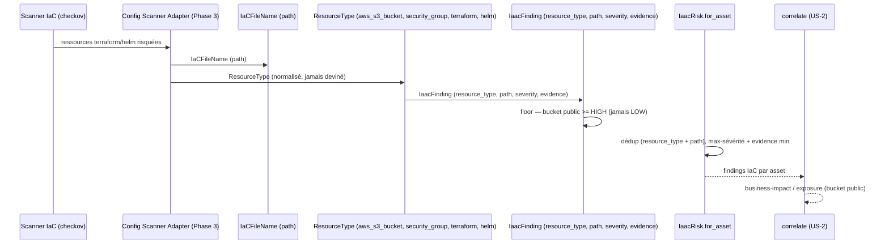

# SEC-17 — iaac_risk : l'infra-as-code (contexte 18)

Le contexte `iaac_risk` normalise les findings IaC (terraform/helm risqués) en
`IaacFinding` classés par `ResourceType`, avec une `severity` qui respecte le
floor du type (un bucket public est au moins HIGH, jamais LOW). Il alimente la
corrélation `business-impact`/`exposure` (bucket public) et permet au rapport de
dire « cette ressource est mal configurée ». Le domaine reste pur : zéro import
scanner/adapter/SDK.

## Key Points

- `ResourceType` (aws_s3_bucket, aws_security_group, aws_iam_role,
  azure_storage_account, gcp_storage_bucket, terraform, helm) ; `normalize()`
  rejette l'inconnu. `min_severity()` : ressources cloud à risque → **HIGH**,
  fichiers génériques terraform/helm → aucun floor (LOW).
- `IaacFinding` exige `resource_type`/`path`/`severity` type-corrects + `evidence`
  non vide, et **valide le floor** : `aws_s3_bucket` avec LOW → `ValueError`
  (un bucket public n'est jamais LOW).
- `IaCFileName` (path) est normalisé (strippé) — aucun identifiant non confondu.
- `IaacRisk.for_asset` déduplique par (resource_type, path) — une ressource déjà
  rapportée (même retirée du repo) est **tracée une fois, jamais dupliquée** ; un
  finding de sévérité basse est conservé ; sur doublon **max-sévérité** puis
  **evidence min** — déterminisme indépendant de l'ordre ; jamais d'échec si aucun.
- Consommé par `correlate` (business-impact / exposure) ; le mandat (consent)
  reste obligatoire.

## Test Coverage

| Fichier | Couverture de branches |
|---|---|
| `domain/iaac_risk/resource_type.py` | 100 % |
| `domain/iaac_risk/ia_c_file_name.py` | 100 % |
| `domain/iaac_risk/iaac_finding.py` | 100 % |
| `domain/iaac_risk/iaac_risk.py` | 100 % |

## Related Files

- `src/hexa_sec/domain/iaac_risk/iaac_risk.py` — l'agrégat `for_asset`
- `src/hexa_sec/domain/iaac_risk/iaac_finding.py` — le VO `IaacFinding` (floor sévérité)
- `src/hexa_sec/domain/iaac_risk/resource_type.py` — l'enum `ResourceType`
- `src/hexa_sec/domain/iaac_risk/ia_c_file_name.py` — le VO `IaCFileName`
- `src/hexa_sec/domain/finding/severity.py` — `Severity` (réutilisé, DRY)
- `tests/unit/domain/test_iaac_risk.py` — scénarios d'inventaire et edge cases
