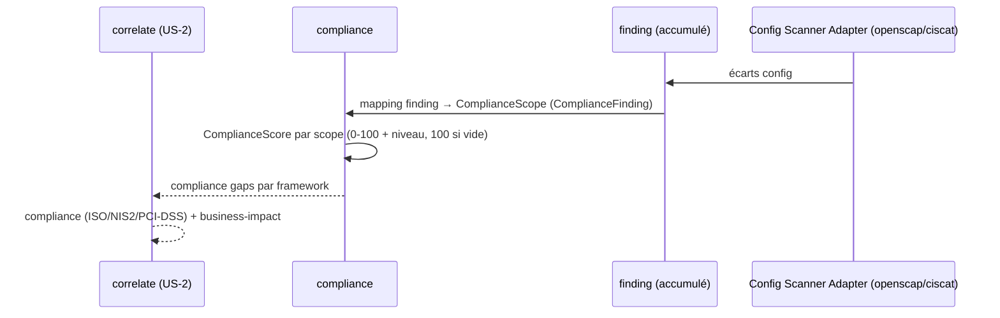

# SEC-18 — compliance : les référentiels (contexte 19)

Le contexte `compliance` relie les findings aux frameworks de responsabilité
(ISO 27001, RGPD, NIS2, PCI-DSS) via `ComplianceFinding` et score chaque cadre
0..100 via `ComplianceScore`. Il alimente la corrélation `compliance` et permet
au rapport de dire « voici les 4 écarts qui vous bloquent pour ISO 27001 ».
Le domaine reste pur : zéro import scanner/adapter/SDK.

## Key Points

- `ComplianceFinding` attache **explicitement** un finding à un framework :
  `finding_id` (`FindingId`) + `scope` (`ComplianceScope`) + `impact` (`Severity`).
  Un finding n'est jamais rattaché au hasard — pas d'identifiant vide.
- `ComplianceScore` (déjà en place) : value 0..100 + `level()` (COMPLIANT ≥ 85,
  ADEQUATE ≥ 60, NON_COMPLIANT). Cohérence niveau↔valeur garantie par le score.
- `ComplianceRisk.for_asset` **déduplique** (finding_id, scope) (impact max),
  **score les 4 frameworks** : `100 - Σ(rank×8)`, clamp ≥ 0 ; un cadre sans écart
  est score 100 — la **base est tracée, jamais inventée** ; jamais d'échec.
- `non_compliant_scopes()` expose les cadres qui échouent ; l'asset est normalisé.
- Consommé par `correlate` (compliance) ; le mandat (consent) reste obligatoire.

## Test Coverage

| Fichier | Couverture de branches |
|---|---|
| `domain/compliance/compliance_scope.py` | 100 % |
| `domain/compliance/compliance_score.py` | 100 % |
| `domain/compliance/compliance_finding.py` | 100 % |
| `domain/compliance/compliance_risk.py` | 100 % |

## Related Files

- `src/hexa_sec/domain/compliance/compliance_risk.py` — l'agrégat `for_asset`
- `src/hexa_sec/domain/compliance/compliance_finding.py` — le lien finding→framework
- `src/hexa_sec/domain/compliance/compliance_score.py` — `ComplianceScore`/`ComplianceLevel`
- `src/hexa_sec/domain/compliance/compliance_scope.py` — `ComplianceScope`
- `src/hexa_sec/domain/finding/finding.py` — `FindingId` (réutilisé, DRY)
- `tests/unit/domain/test_compliance_risk.py` — scénarios de scoring et edge cases
