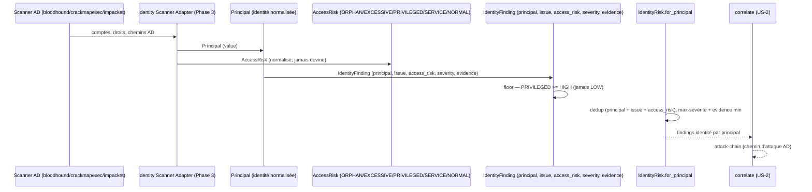

# SEC-19 — identity_risk : AD, SSO, accès (contexte 20)

Le contexte `identity_risk` normalise les findings identité (comptes orphelins,
droits excessifs, chemins AD faibles) en `IdentityFinding` classés par
`AccessRisk`, avec une `severity` qui respecte le floor du risque (un compte
PRIVILEGED est au moins HIGH, jamais LOW). Il alimente la corrélation
`attack-chain` (chemin d'attaque AD) et permet au rapport de dire « ce compte a
des droits excessifs ». Le domaine reste pur : zéro import scanner/adapter/SDK.

## Key Points

- `AccessRisk` (ORPHAN / EXCESSIVE / PRIVILEGED / SERVICE / NORMAL) ;
  `normalize()` rejette l'inconnu. `min_severity()` : **PRIVILEGED → HIGH**
  (seul invariant AC), les autres → aucun floor (un MEDIUM légitime n'est jamais
  écarté).
- `Principal` (identité) est **normalisé** (strippé) — aucun identifiant non
  confondu dans l'agrégation.
- `IdentityFinding` exige `principal`/`issue`/`access_risk`/`severity`/`evidence`
  valides, et **valide le floor** : `PRIVILEGED` avec LOW → `ValueError`.
- `IdentityRisk.for_principal` déduplique par (principal, issue, access_risk) —
  issues distinctes séparées ; un **compte technique** (SERVICE, low) est
  **conservé** ; sur doublon **max-sévérité** puis **evidence min** —
  déterminisme indépendant de l'ordre (transivité testée) ; jamais d'échec.
- Consommé par `correlate` (attack-chain) ; le mandat (consent) reste obligatoire.

## Test Coverage

| Fichier | Couverture de branches |
|---|---|
| `domain/identity_risk/access_risk.py` | 100 % |
| `domain/identity_risk/principal.py` | 100 % |
| `domain/identity_risk/identity_finding.py` | 100 % |
| `domain/identity_risk/identity_risk.py` | 100 % |

## Related Files

- `src/hexa_sec/domain/identity_risk/identity_risk.py` — l'agrégat `for_principal`
- `src/hexa_sec/domain/identity_risk/identity_finding.py` — le VO `IdentityFinding` (floor sévérité)
- `src/hexa_sec/domain/identity_risk/access_risk.py` — l'enum `AccessRisk`
- `src/hexa_sec/domain/identity_risk/principal.py` — le VO `Principal`
- `src/hexa_sec/domain/finding/severity.py` — `Severity` (réutilisé, DRY)
- `tests/unit/domain/test_identity_risk.py` — scénarios d'inventaire et edge cases
