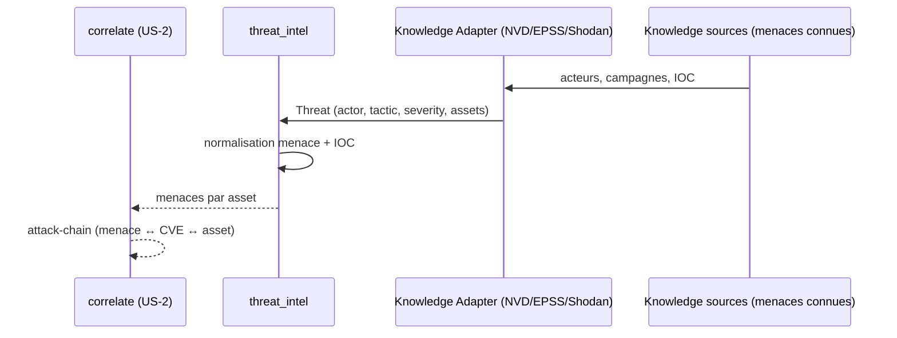

# SEC-20 — threat_intel : les menaces connues (contexte 21)

Le contexte `threat_intel` normalise les menaces connues (acteurs, campagnes,
IOC) en `Threat` classés par acteur/tactique, avec un `ThreatActor` et un `Ioc`,
et relie la menace aux assets exposés (avec preuve). Il alimente la corrélation
`attack-chain` (menace ↔ CVE ↔ asset) et le scoring (une faille activement
exploitée = plus critique). Le domaine reste pur : zéro import scanner/adapter/SDK.

## Key Points

- `ThreatActor` (APT-41, FIN7…) : `identifier` + `description`, non vides,
  **normalisés** (identifiant jamais mal-matché).
- `IocType` (IP/DOMAIN/HASH/URL) + `Ioc(value, ioc_type)` : `value` non vide,
  `ioc_type` **requis** (jamais deviné), `value` normalisé.
- `Threat` (actor, tactic, severity, related_assets, related_findings, iocs) :
  **preuve obligatoire** — des `related_assets` sans `related_findings` → `ValueError`
  (pas de spéculation) ; `related_assets` vide = menace connue **abstraite** acceptée.
- `ThreatIntel.for_asset` retourne les menaces qui touchent l'asset, **dédupliquées**
  par (actor, tactic) — **sévérité max** puis lien canonique déterministe,
  **indépendant de l'ordre** (transivité testée) ; menaces abstraites exclues ;
  jamais d'échec.
- Consommé par `correlate` (attack-chain) ; le mandat (consent) reste obligatoire.

## Test Coverage

| Fichier | Couverture de branches |
|---|---|
| `domain/threat_intel/threat_actor.py` | 100 % |
| `domain/threat_intel/ioc.py` | 100 % |
| `domain/threat_intel/threat.py` | 100 % |
| `domain/threat_intel/threat_intel.py` | 100 % |

## Related Files

- `src/hexa_sec/domain/threat_intel/threat_intel.py` — l'agrégat `for_asset`
- `src/hexa_sec/domain/threat_intel/threat.py` — le VO `Threat` (preuve obligatoire)
- `src/hexa_sec/domain/threat_intel/threat_actor.py` — le VO `ThreatActor`
- `src/hexa_sec/domain/threat_intel/ioc.py` — `Ioc`/`IocType`
- `src/hexa_sec/domain/asset/asset.py` — `AssetId` (réutilisé) · `domain/finding/` — `FindingId`/`Severity`
- `tests/unit/domain/test_threat_intel.py` — scénarios d'inventaire et edge cases
