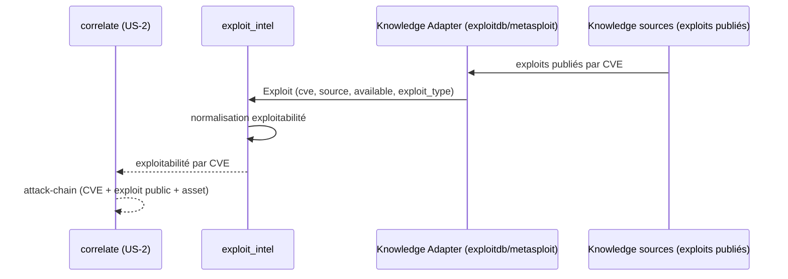

# SEC-21 — exploit_intel : les exploits publiés (contexte 22)

Le contexte `exploit_intel` normalise les exploits publiés (exploit-db,
metasploit) en `Exploit` classés par `ExploitType`, avec une `Exploitability`
dérivée de la disponibilité et de la source. Il alimente la corrélation
`attack-chain` et le scoring (exploitability) : « cette CVE a un exploit public,
corrige d'urgence ». Le domaine reste pur : zéro import scanner/adapter/SDK.

## Key Points

- `ExploitType` (METASPLOIT / EXPLOIT_DB / SEARCHSPLOIT / CUSTOM) ; `normalize()`
  rejette l'inconnu. `rank` : METASPLOIT > EXPLOIT_DB > SEARCHSPLOIT > CUSTOM.
- `Exploitability` (available + `Confidence` réutilisé de `finding`) dérivée :
  `available=False → LOW` (non exploitable) ; METASPLOIT→CERTAIN, EXPLOIT_DB→HIGH,
  SEARCHSPLOIT→MEDIUM, CUSTOM→LOW. `exploitable = available`.
- `Exploit` (cve, source, exploit_type, evidence, available) : `cve` **normalisée**
  (uppercase), `source` strippée, `evidence` **obligatoire** (pas d'exploit sans
  preuve), `exploitability` **dérivée**.
- `ExploitIntel.for_cve` déduplique par (cve, source) — **available gagne** sur
  révoqué, puis le rang de source, puis l'evidence min — **indépendant de
  l'ordre** ; un exploit révoqué (`available=False`) seul est **conservé**
  (marqué, jamais supprimé silencieusement) ; jamais d'échec ; `exploit_count`.
- Consommé par `correlate` (attack-chain) + scoring ; le mandat (consent)
  reste obligatoire. La disposition évite l'import circulaire
  (`Exploitability.derive ↔ Exploit`), et aucune fonction ne prend `bool` en
  paramètre (garde boolean-flag).

## Test Coverage

| Fichier | Couverture de branches |
|---|---|
| `domain/exploit_intel/exploit.py` | 100 % |
| `domain/exploit_intel/exploit_intel.py` | 100 % |

## Related Files

- `src/hexa_sec/domain/exploit_intel/exploit_intel.py` — l'agrégat `for_cve`
- `src/hexa_sec/domain/exploit_intel/exploit.py` — `Exploit`/`ExploitType`/`Exploitability`
- `src/hexa_sec/domain/finding/confidence.py` — `Confidence` (réutilisé, DRY)
- `tests/unit/domain/test_exploit_intel.py` — scénarios d'inventaire et edge cases
