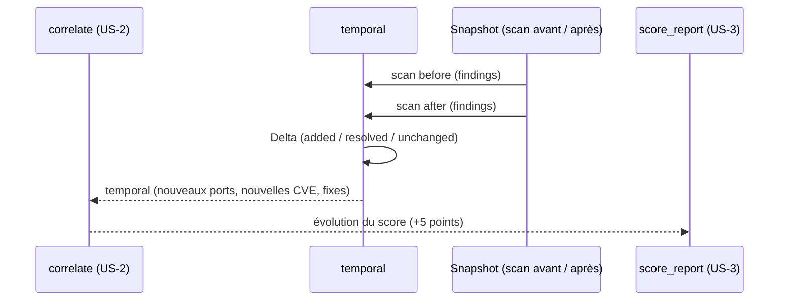

# SEC-22 — temporal : ce qui a changé entre 2 scans (contexte 23)

Le contexte `temporal` compare deux snapshots de scan et matérialise le
changement en un `Delta` déterministe : nouveaux findings, findings résolus,
trousse inchangée. Il alimente la corrélation `temporal` (US-2) et l'évolution
du score dans le rapport (US-3, « votre SI a monté de 5 points »). Le domaine
reste pur : zéro import scanner/adapter/SDK.

## Key Points

- `Snapshot` (scan_id + taken_on) : les deux champs obligatoires et **normalisés** —
  un identifiant/date paddé casserait silencieusement la comparaison.
- `ChangeKind` (ADDED / RESOLVED / UNCHANGED) + `Delta` (before, after,
  added_findings, resolved_findings, unchanged_count) : `added = après − avant`,
  `resolved = avant − après`, `unchanged = avant ∩ après` (`FindingId`).
- `Delta.compute` **exige deux scans distincts** (`ValueError` si même scan_id) —
  pas de delta d'un même scan ; deux scans à **findings identiques → tout
  UNCHANGED** (pas d'invention) ; `changes()` trie (ADDED puis RESOLVED).
- **Cohérence** : `added` et `resolved` disjoints (une finding ne peut pas être
  les deux) ; `unchanged_count >= 0` — un delta incohérent est rejeté.
- `Temporal.of` **déduplique** les snapshots par (scan_id, taken_on) et les trie ;
  `delta_between` produit le `Delta`.
- Consommé par `correlate` (temporal) et `score_report` (évolution) ; le mandat
  (consent) reste obligatoire.

## Test Coverage

| Fichier | Couverture de branches |
|---|---|
| `domain/temporal/snapshot.py` | 100 % |
| `domain/temporal/delta.py` | 100 % |
| `domain/temporal/temporal.py` | 100 % |

## Related Files

- `src/hexa_sec/domain/temporal/delta.py` — `ChangeKind` + `Delta` (`compute`/`changes`)
- `src/hexa_sec/domain/temporal/snapshot.py` — `Snapshot`
- `src/hexa_sec/domain/temporal/temporal.py` — l'agrégat `Temporal`
- `src/hexa_sec/domain/finding/finding.py` — `FindingId` (réutilisé, DRY)
- `tests/unit/domain/test_temporal.py` — scénarios d'évolution et edge cases
