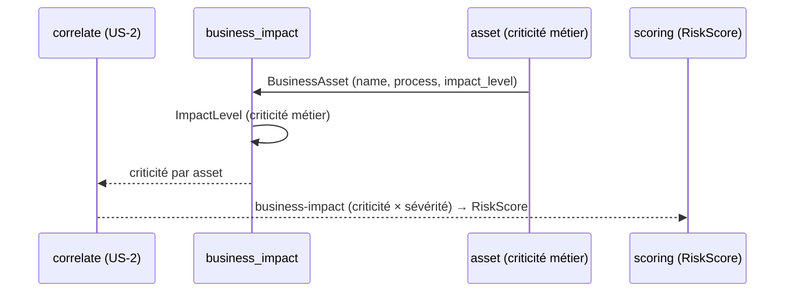

# SEC-23 — business_impact : la criticité métier des assets (contexte 24)

Le contexte `business_impact` modélise la criticité métier d'un asset
(`BusinessAsset` = name + process + `ImpactLevel`). C'est le multiplicateur qui
rend le score honnête : une faille sur le serveur de paiement compte plus que sur
un blog. Il alimente la corrélation `business-impact` (criticité × sévérité) et le
scoring. Le domaine reste pur : zéro import scanner/adapter/SDK.

## Key Points

- `ImpactLevel` (NORMAL → CRITICAL) : `rank` croissant (CRITICAL = 4, le plus
  élevé → « score métier élevé »), `is_critical`, `normalize()` rejette l'inconnu.
  **Distinct** de l'`ImpactLevel` de `correlation` (échelle de report d'une
  corrélation) — ici, criticité **métier** d'une asset.
- `BusinessAsset` (name, process, impact_level) : name/process **normalisés**,
  `impact_level` validé ; **un asset métier a toujours un process** (rejet sinon).
- `BusinessImpact.for_asset` : filtre par name, **dédup (name, process)** triée de
  façon déterministe — jamais de doublon, jamais d'échec si aucun asset.
- `critical_assets()` / `critical_count` exposent les assets business-critiques.
- Consommé par `correlate` (business-impact) et le scoring ; le mandat (consent)
  reste obligatoire.

## Test Coverage

| Fichier | Couverture de branches |
|---|---|
| `domain/business_impact/impact_level.py` | 100 % |
| `domain/business_impact/business_asset.py` | 100 % |
| `domain/business_impact/business_impact.py` | 100 % |

## Related Files

- `src/hexa_sec/domain/business_impact/business_impact.py` — l'agrégat `for_asset`
- `src/hexa_sec/domain/business_impact/business_asset.py` — le VO `BusinessAsset`
- `src/hexa_sec/domain/business_impact/impact_level.py` — l'enum `ImpactLevel` (criticité métier)
- `src/hexa_sec/domain/correlation/impact_score.py` — `ImpactLevel` de la corrélation (distinct)
- `tests/unit/domain/test_business_impact.py` — scénarios d'impact et edge cases
