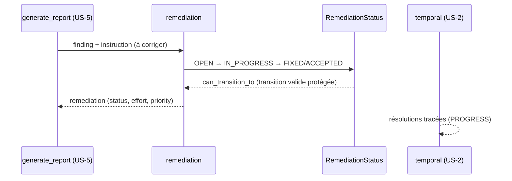

# SEC-24 — remediation : les fixes et leur statut (contexte 25)

Le contexte `remediation` lie un finding à sa recommandation de fix, suit son
cycle de vie (OPEN → IN_PROGRESS → FIXED/ACCEPTED) et capture effort/priorité,
avec **transitions de statut protégées** (un fix ne devient FIXED que par un cycle
valide — jamais « depuis le vide »). Il alimente `generate_report` (section
technique) et la corrélation `temporal` (suivi des résolutions). Le domaine reste
pur : zéro import scanner/adapter/SDK.

## Key Points

- `RemediationStatus` (OPEN / IN_PROGRESS / FIXED / ACCEPTED) : `is_resolved()`
  (FIXED/ACCEPTED) ; `can_transition_to` — OPEN→{IN_PROGRESS, ACCEPTED},
  IN_PROGRESS→{FIXED, ACCEPTED}, terminaison (FIXED/ACCEPTED) → aucune sortie.
- `Remediation` (finding_id, instruction, status, effort, priority) : `finding_id`
  **obligatoire** (ajouté, l'ancien stub ne le validait pas) + normalisé ;
  `transition_to(new)` retourne une **nouvelle** instance et **refuse** la
  transition illégale (OPEN→FIXED, même statut, sortie d'état terminal) ;
  **`Effort`/`Priority`** optionnels, préserdés par la transition.
- `Priority` (HIGH/MEDIUM/LOW) **défini ici** — le AC disait « déjà porté par le
  scoring » mais `scoring` n'a que `ScoreLevel` (CRITICAL/HIGH/MODERATE/LOW).
- `Effort(minutes >= 0)` + `readable()` (ex. `2h30`).
- **Construction stricte** : on ne peut **pas** créer une remediation en état
  terminal (FIXED/ACCEPTED) — seulement via `transition_to` (le cycle protégé).
- Consommé par `generate_report` (US-5) et `temporal` ; le mandat (consent)
  reste obligatoire.

## Test Coverage

| Fichier | Couverture de branches |
|---|---|
| `domain/remediation/priority.py` | 100 % |
| `domain/remediation/effort.py` | 100 % |
| `domain/remediation/remediation.py` | 100 % |
| `domain/remediation/remediation_status.py` | 100 % |

## Related Files

- `src/hexa_sec/domain/remediation/remediation.py` — `Remediation` + `transition_to`
- `src/hexa_sec/domain/remediation/remediation_status.py` — `RemediationStatus` + `can_transition_to`
- `src/hexa_sec/domain/remediation/effort.py` — `Effort`
- `src/hexa_sec/domain/remediation/priority.py` — `Priority`
- `tests/unit/domain/test_remediation.py` — transitions et edge cases
