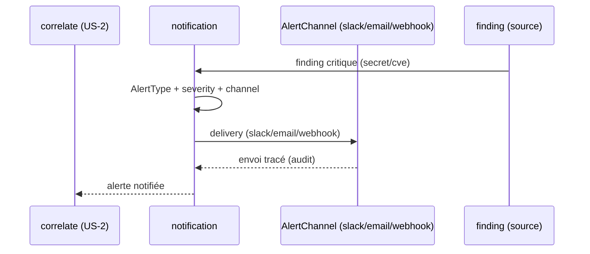

# SEC-25 — notification : les alertes (contexte 26)

Le contexte `notification` normalise les alertes (nouveau secret, CVE critique,
exposition) en `Alert` classées par `AlertType`, `severity` et `AlertChannel`,
avec un `finding_id` source obligatoire pour les alertes CRITICAL. Il alimente la
delivery (Phase 6) et la corrélation `exposure` : « notifie-moi quand un secret
critique est commité ». Le domaine reste pur : zéro import scanner/adapter/SDK.

## Key Points

- `AlertType` (NEWSECRET / CRITICALCVE / NEWEXPOSURE / COMPLIANCEGAP /
  FIX_RESOLVED) et `AlertChannel` (SLACK / EMAIL / WEBHOOK) ; `normalize()`
  rejette l'inconnu (jamais deviné) — accepte les variantes espace/tiret/underscore
  et le nom compact (`NEWSECRET`).
- `Alert` (subject, alert_type, severity, channel, finding_id) : `subject`
  normalisé ; `severity` (reuse finding) ; **CRITICAL ⇒ `finding_id` requis**
  (pas d'alerte vide) ; non-CRITICAL ⇒ finding optionnel.
- `Notification.of` **déduplique** par (subject, alert_type, finding) — sévérité
  max (puis canal) gagne, **indépendant de l'ordre** ; jamais d'échec si aucune
  alerte ; `critical_count`.
- Consommé par la notification (Phase 6) et `correlate` (exposure) ; le mandat
  (consent) reste obligatoire.

## Test Coverage

| Fichier | Couverture de branches |
|---|---|
| `domain/notification/alert_type.py` | 100 % |
| `domain/notification/alert_channel.py` | 100 % |
| `domain/notification/alert.py` | 100 % |
| `domain/notification/notification.py` | 100 % |

## Related Files

- `src/hexa_sec/domain/notification/notification.py` — l'agrégat `of`
- `src/hexa_sec/domain/notification/alert.py` — le VO `Alert` (CRITICAL ⇒ finding)
- `src/hexa_sec/domain/notification/alert_type.py` — l'enum `AlertType`
- `src/hexa_sec/domain/notification/alert_channel.py` — l'enum `AlertChannel`
- `tests/unit/domain/test_notification.py` — scénarios de delivery et edge cases
