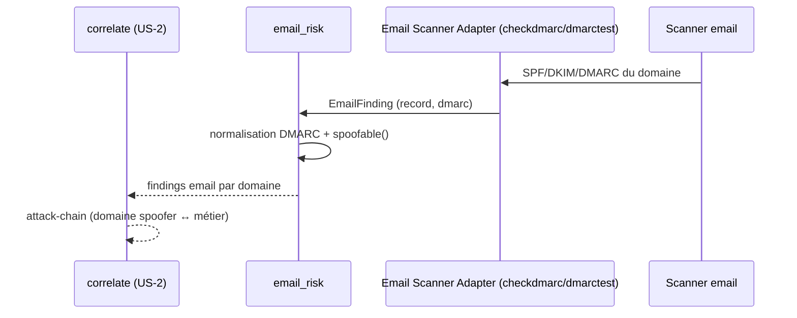

# SEC-26 — email_risk : l'usurpation d'email (SPF, DKIM, DMARC) (contexte 27)

Le contexte `email_risk` normalise la surface email (SPF/DKIM/DMARC) en
`EmailFinding`/`EmailRecord` classés par `DmarcStatus`, et détermine `spoofable()`.
Il alimente la corrélation `attack-chain` (domaine spoofer ↔ asset métier).
Le domaine reste pur : zéro import scanner/adapter/SDK.

## Key Points

- `DmarcStatus` (REJECT / QUARANTINE / NONE / MISSING) + `enforced`.
- `EmailRecord` (domain, spf, dkim) : `domain` **normalisé** (leçon `/ed` — dédup
  par domaine jamais cassée par un padding).
- `EmailFinding` (record, dmarc) : **`__post_init__` ajouté** — valide `record`
  (EmailRecord) et `dmarc` (DmarcStatus) ; `domain`/`spoofable()` (**NONE/MISSING**).
- `EmailRisk.of` **déduplique** par domaine (le pire DMARC — MISSING > NONE >
  QUARANTINE > REJECT — gagne), **indépendant de l'ordre** ; jamais d'échec si
  aucun domaine spoofer ; `spoofable_count`/`spoofable_domains()`.
- Consommé par `correlate` (attack-chain) ; le mandat (consent) reste obligatoire.
- **Décision** : `dmarc` reste **uniquement** sur `EmailFinding` (Option A —
  `EmailRecord` = domain/spf/dkim, pas de duplication) ; pas de champ `severity`
  (le modèle `spoofable()` suffit).

## Test Coverage

| Fichier | Couverture de branches |
|---|---|
| `domain/email_risk/dmarc_status.py` | 100 % |
| `domain/email_risk/email_record.py` | 100 % |
| `domain/email_risk/email_finding.py` | 100 % |
| `domain/email_risk/email_risk.py` | 100 % |

## Related Files

- `src/hexa_sec/domain/email_risk/email_risk.py` — l'agrégat `of`
- `src/hexa_sec/domain/email_risk/email_finding.py` — `EmailFinding` + `spoofable()`
- `src/hexa_sec/domain/email_risk/email_record.py` — `EmailRecord`
- `src/hexa_sec/domain/email_risk/dmarc_status.py` — `DmarcStatus`
- `tests/unit/domain/test_email_risk.py` — scénarios de delivery et edge cases
