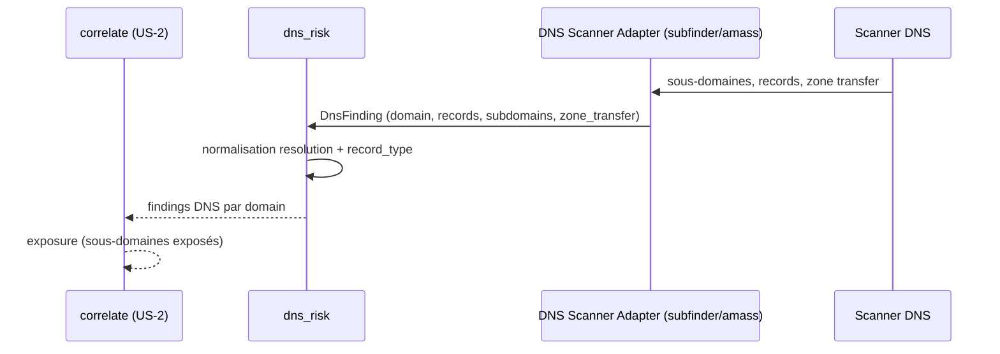

# SEC-27 — dns_risk : sous-domaines oubliés, DNS exposé (contexte 28)

Le contexte `dns_risk` normalise la surface DNS (records, sous-domaines résolus,
zone transfer) en `DnsFinding`, et détermine `exposed()` / `has_zone_transfer()`.
Il alimente la corrélation `exposure` (sous-domaines exposés). Le domaine reste
pur : zéro import scanner/adapter/SDK.

## Key Points

- `RecordType` (A/AAAA/CNAME/MX/TXT/NS/SOA) + **`normalize()` ajouté** — rejette
  l'inconnu (le AC l'exige ; les adapters subfinder/amass sortent des types).
- `DnsRecord` (name, record_type, value) : **`record_type` validé** (`isinstance`,
  l'invariant « record_type valide » manquait).
- `DnsFinding` (domain, records, subdomains, zone_transfer) : **`domain` normalisé**
  (leçon `/ed` — dédup par domaine jamais cassée par un padding) ; `exposed()`
  (un sous-domaine résolu), `has_zone_transfer()`.
- `DnsRisk.of` **déduplique** par domaine (zone_transfer > exposed — le pire gagne),
  **indépendant de l'ordre** ; jamais d'échec ; `exposed_count`/`exposed_domains()`/
  `zone_transfer_count`.
- Consommé par `correlate` (exposure) ; le mandat (consent) reste obligatoire.

## Test Coverage

| Fichier | Couverture de branches |
|---|---|
| `domain/dns_risk/record_type.py` | 100 % |
| `domain/dns_risk/dns_record.py` | 100 % |
| `domain/dns_risk/subdomain.py` | 100 % |
| `domain/dns_risk/dns_finding.py` | 100 % |
| `domain/dns_risk/dns_risk.py` | 100 % |

## Related Files

- `src/hexa_sec/domain/dns_risk/dns_risk.py` — l'agrégat `of`
- `src/hexa_sec/domain/dns_risk/dns_finding.py` — `DnsFinding` + `exposed()`
- `src/hexa_sec/domain/dns_risk/dns_record.py` — `DnsRecord`
- `src/hexa_sec/domain/dns_risk/record_type.py` — `RecordType`
- `src/hexa_sec/domain/dns_risk/subdomain.py` — `Subdomain`
- `tests/unit/domain/test_dns_risk.py` — scénarios d'exposition et edge cases
