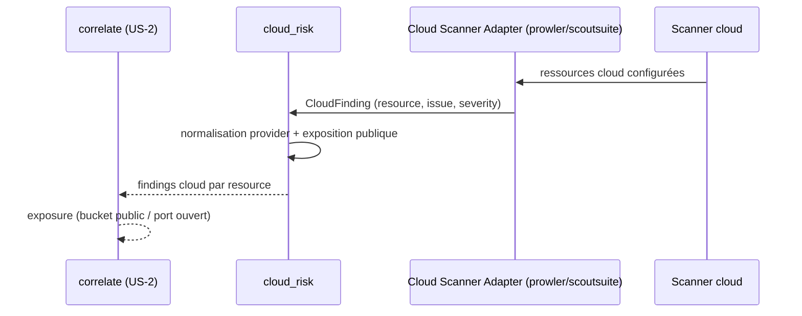

# SEC-28 — cloud_risk : ressources cloud mal configurées (contexte 29)

Le contexte `cloud_risk` normalise les findings cloud (bucket public, groupe de
sécurité ouvert, ressource sans chiffrement) en `CloudFinding` classés par
`CloudResource`/`CloudProvider`, avec `exposed()`. Il alimente la corrélation
`exposure` (« ce bucket est public »). Le domaine reste pur : zéro import
scanner/adapter/SDK.

## Key Points

- `CloudProvider` (AWS/AZURE/GCP) + **`normalize()` ajouté** (rejette l'inconnu).
- `CloudResource` (provider, resource_id, resource_type, public) : **`provider`
  validé** + `resource_id`/`resource_type` **normalisés** ; `is_public()`.
- `CloudFinding` (resource, issue, severity) : **`resource` + `severity` validés**,
  `issue` **normalisé** ; `exposed() = resource.is_public()`.
- `CloudRisk.of` **déduplique** par ressource (l'exposée gagne), **indépendant de
  l'ordre** ; jamais d'échec ; `exposed_count`/`exposed_resources()`.
- Consommé par `correlate` (exposure) ; le mandat (consent) reste obligatoire.
- **Note** : l'AC nomme le champ `name`, le code a `resource_id` — conservé (`le AC
  le dit validé`).

## Test Coverage

| Fichier | Couverture de branches |
|---|---|
| `domain/cloud_risk/cloud_provider.py` | 100 % |
| `domain/cloud_risk/cloud_resource.py` | 100 % |
| `domain/cloud_risk/cloud_finding.py` | 100 % |
| `domain/cloud_risk/cloud_risk.py` | 100 % |

## Related Files

- `src/hexa_sec/domain/cloud_risk/cloud_risk.py` — l'agrégat `of`
- `src/hexa_sec/domain/cloud_risk/cloud_finding.py` — `CloudFinding` + `exposed()`
- `src/hexa_sec/domain/cloud_risk/cloud_resource.py` — `CloudResource`
- `src/hexa_sec/domain/cloud_risk/cloud_provider.py` — `CloudProvider`
- `tests/unit/domain/test_cloud_risk.py` — scénarios d'exposition et edge cases
