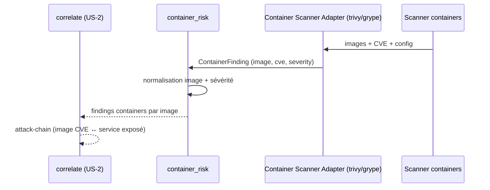

# SEC-29 — container_risk : images & runtimes containers (contexte 30)

Le contexte `container_risk` normalise les findings de conteneurs (CVE d'image,
misconfig runtime) en `ContainerFinding` classés par `ImageRef` et sévérité, avec
`severe()`. Il alimente la corrélation `attack-chain` (image vulnérable ↔ service
exposé). Le domaine reste pur : zéro import scanner/adapter/SDK.

## Key Points

- `ImageRef` (repository, tag, + **digest optionnel** ajouté) : champs **normalisés**
  (leçon `/ed` — dédup par image jamais cassée par un padding) ; `qualified`.
- `ContainerFinding` (image, cve, severity) : **`image` + `severity` validés**
  (invariants AC « image valide · severity valide »), `cve` **normalisée** (uppercase,
  cohérent avec `vulnerability`) ; `severe()` = HIGH/CRITICAL.
- `ContainerRisk.of` **déduplique** par (image, cve) — sévérité max, ordre-indépendant ;
  **même CVE dans 2 images ⇒ séparées** ; jamais d'échec si aucune CVE ;
  `vulnerable_count`/`severe_count`/`severe_images()`.
- Consommé par `correlate` (attack-chain) ; le mandat (consent) reste obligatoire.
- **Note** : l'AC nomme le champ `name`, le code a `repository` — conservé
  (`le AC le dit validé`) ; `tag` requis (l'edge « image sans tag → latest » est la
  responsabilité de l'adapter).

## Test Coverage

| Fichier | Couverture de branches |
|---|---|
| `domain/container_risk/image_ref.py` | 100 % |
| `domain/container_risk/container_finding.py` | 100 % |
| `domain/container_risk/container_risk.py` | 100 % |

## Related Files

- `src/hexa_sec/domain/container_risk/container_risk.py` — l'agrégat `of`
- `src/hexa_sec/domain/container_risk/container_finding.py` — `ContainerFinding` + `severe()`
- `src/hexa_sec/domain/container_risk/image_ref.py` — `ImageRef`
- `tests/unit/domain/test_container_risk.py` — scénarios de vulnérabilité et edge cases
