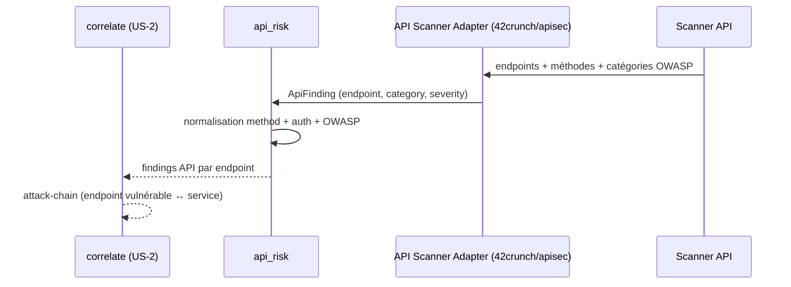

# SEC-30 — api_risk : les API exposées (contexte 31)

Le contexte `api_risk` normalise les findings API (endpoint, méthode HTTP,
catégorie OWASP API Top 10) en `ApiFinding`/`ApiEndpoint`, avec
`requires_auth()`. Il alimente la corrélation `attack-chain` (endpoint vulnérable
↔ service). Le domaine reste pur : zéro import scanner/adapter/SDK.

## Key Points

- `HTTP_METHODS` (GET/POST/PUT/PATCH/DELETE/HEAD/OPTIONS) ; `ApiEndpoint` (method,
  path, `auth_required`) : method normalisée (uppercase, whitelist), **`path`
  normalisé** ; `requires_auth()`.
- `OwaspApiCategory` (api1..api10) + **`normalize()` ajouté** (accepte `API1`/
  `api05`/`10`) — rejette l'inconnu (le AC l'exige ; les adapters 42crunch/apisec
  sortent `apiN`).
- `ApiFinding` (endpoint, category, severity) : **`endpoint`/`category`/`severity`
  validés** + **floor** — un endpoint **sans auth** ⇒ sévérité **min HIGH** (jamais
  LOW/MEDIUM — « pas d'invention »).
- `ApiRisk.of` **déduplique** par (endpoint, category) — sévérité max,
  ordre-indépendant ; jamais d'échec ; `unauthenticated_count`/
  `unauthenticated_endpoints()`.
- Consommé par `correlate` (attack-chain) ; le mandat (consent) reste obligatoire.

## Test Coverage

| Fichier | Couverture de branches |
|---|---|
| `domain/api_risk/owasp_category.py` | 100 % |
| `domain/api_risk/api_endpoint.py` | 100 % |
| `domain/api_risk/api_finding.py` | 100 % |
| `domain/api_risk/api_risk.py` | 100 % |

## Related Files

- `src/hexa_sec/domain/api_risk/api_risk.py` — l'agrégat `of`
- `src/hexa_sec/domain/api_risk/api_finding.py` — `ApiFinding` + floor « sans auth ⇒ HIGH »
- `src/hexa_sec/domain/api_risk/api_endpoint.py` — `ApiEndpoint` + `requires_auth()`
- `src/hexa_sec/domain/api_risk/owasp_category.py` — `OwaspApiCategory`
- `tests/unit/domain/test_api_risk.py` — scénarios d'exposition et edge cases
