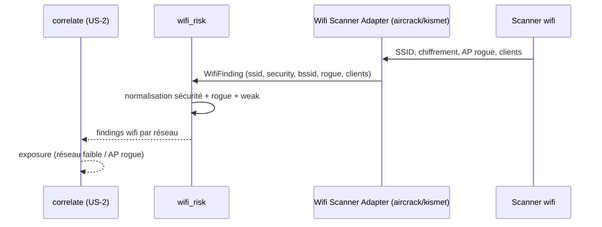

# SEC-31 — wifi_risk : réseau sans fil (SSID, chiffrement, clients) (contexte 32)

Le contexte `wifi_risk` normalise les findings sans fil (SSID, chiffrement, AP
rogue, clients) en `WifiFinding`/`Ssid`/`Bssid`, classés par `WifiSecurity` (weak
= OPEN/WEP/WPA). Il alimente la corrélation `exposure` (réseau faible / AP rogue).
Le domaine reste pur : zéro import scanner/adapter/SDK.

## Key Points

- `Ssid` (≤ 32 chars, trimmé) ; `Bssid` (MAC, **normalisé** — `strip`, leçon `/ed`).
- `WifiSecurity` (OPEN/WEP/WPA/WPA2/WPA3) + `weak` (OPEN/WEP/WPA) + **`normalize()`
  ajouté** (rejette l'inconnu).
- `WifiFinding` (ssid, security, bssid, rogue, clients) : **`ssid`/`security`/`bssid`
  validés** (isinstance — invariants AC manquants) + `clients >= 0` ; `is_open()`,
  `is_rogue()`, `weak`.
- `WifiRisk.of` **déduplique** par (ssid, bssid) — rogue > weak (le pire gagne),
  ordre-indépendant ; jamais d'échec ; `weak_count`/`rogue_count`/`weak_networks()`.
- Consommé par `correlate` (exposure) ; le mandat (consent) reste obligatoire.

## Test Coverage

| Fichier | Couverture de branches |
|---|---|
| `domain/wifi_risk/ssid.py` | 100 % |
| `domain/wifi_risk/wifi_security.py` | 100 % |
| `domain/wifi_risk/wifi_finding.py` | 100 % |
| `domain/wifi_risk/wifi_risk.py` | 100 % |

## Related Files

- `src/hexa_sec/domain/wifi_risk/wifi_risk.py` — l'agrégat `of`
- `src/hexa_sec/domain/wifi_risk/wifi_finding.py` — `WifiFinding` + `weak`/`is_rogue()`
- `src/hexa_sec/domain/wifi_risk/ssid.py` — `Ssid`/`Bssid`
- `src/hexa_sec/domain/wifi_risk/wifi_security.py` — `WifiSecurity`
- `tests/unit/domain/test_wifi_risk.py` — scénarios d'exposition et edge cases
