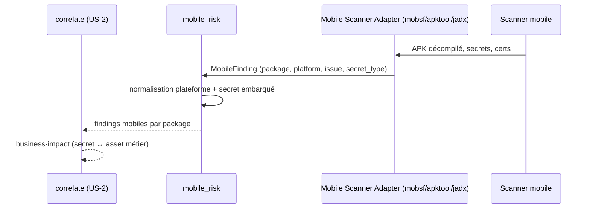

# SEC-32 — mobile_risk : applications mobiles (contexte 33)

Le contexte `mobile_risk` normalise les findings mobiles (package, plateforme,
secret embarqué) en `MobileFinding`, avec `MobilePlatform` (ANDROID/IOS) et le
lien vers `secret_risk.SecretType` (`embeds_secret()`). Il alimente la corrélation
`business-impact` (secret ↔ asset métier). Le domaine reste pur : zéro import
scanner/adapter/SDK.

## Key Points

- `MobilePlatform` (ANDROID/IOS) + **`normalize()` ajouté** (rejette l'inconnu).
- `MobileFinding` (package, platform, issue, secret_type) : **`platform` validé +
  `secret_type` validé** (isinstance SecretType — invariant « référence
  secret_risk » manquant) ; `package`/`issue` **normalisés** ; `embeds_secret()`.
- `MobileRisk.of` **déduplique** par (package, issue) — le finding avec secret
  embarqué gagne (ordre total déterministe), ordre-indépendant ; jamais d'échec ;
  `secret_count`/`secret_packages()`.
- App sans secret → `embeds_secret() = False` (pas d'invention).
- Consommé par `correlate` (business-impact) ; le mandat (consent) reste
  obligatoire.

## Test Coverage

| Fichier | Couverture de branches |
|---|---|
| `domain/mobile_risk/mobile_platform.py` | 100 % |
| `domain/mobile_risk/mobile_finding.py` | 100 % |
| `domain/mobile_risk/mobile_risk.py` | 100 % |

## Related Files

- `src/hexa_sec/domain/mobile_risk/mobile_risk.py` — l'agrégat `of`
- `src/hexa_sec/domain/mobile_risk/mobile_finding.py` — `MobileFinding` + `embeds_secret()`
- `src/hexa_sec/domain/mobile_risk/mobile_platform.py` — `MobilePlatform`
- `src/hexa_sec/domain/secret_risk/secret_type.py` — `SecretType` (réutilisé, DRY)
- `tests/unit/domain/test_mobile_risk.py` — scénarios de secrets et edge cases
