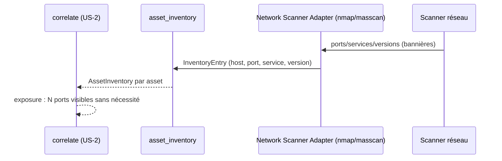

# SEC-33 — asset_inventory : l'inventaire SI (contexte 6)

Le contexte `asset_inventory` normalise ce que les scanners découvrent (ports,
services, versions) en `InventoryEntry`, consolidé par asset via `AssetInventory`,
avec `Port` (1-65535), `Application` (le service), `Version`. Il alimente la
corrélation `exposure` (« N ports visibles sans nécessité »). Le domaine reste
pur : zéro import scanner/adapter/SDK.

## Key Points

- `Port` (1-65535), `Application` (le « service », normalisé lowercase), `Version`
  (optionnel) — VOs frozen.
- `InventoryEntry` (host, port, application, version) : **`host` normalisé**,
  **`port`/`application` validés** (isinstance) ; version null-safe.
- `AssetInventory` : `host` **normalisé** (leçon `/ed` — dédup/filtre par host
  jamais cassés par un padding) ; **invariant** host/entrées cohérents + pas de
  doublon (port, application) à la construction directe.
- **`AssetInventory.for_asset(host, entries)` ajouté** : consolide les entrées
  d'un asset, **déduplique par port**, filtre les hôtes étrangers, jamais d'échec.
- Consommé par `network_risk` (contexte 12) et la corrélation `exposure` (US-2) ;
  le mandat (consent) reste obligatoire.

## Test Coverage

| Fichier | Couverture de branches |
|---|---|
| `domain/asset_inventory/port.py` | 100 % |
| `domain/asset_inventory/inventory.py` | 100 % |

## Related Files

- `src/hexa_sec/domain/asset_inventory/inventory.py` — `InventoryEntry` + `AssetInventory.for_asset`
- `src/hexa_sec/domain/asset_inventory/port.py` — `Port`/`Application`/`Version`
- `src/hexa_sec/domain/network_risk/network_risk.py` — consomme Port/Application (DRY)
- `tests/unit/domain/test_inventory.py` — scénarios d'inventaire et edge cases
