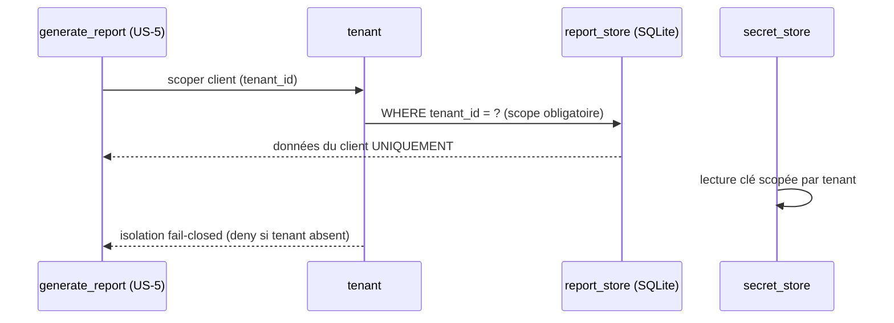

# SEC-34 — tenant : l'isolation par client (contexte 28)

Le contexte `tenant` est la **pierre angulaire** de l'isolation multi-tenant :
`TenantId` (le scope absolu de chaque scan/secret/rapport) + `Tenant`, la
frontière d'isolation. C'est le socle fail-closed de toute la stack. Le domaine
reste pur : zéro import scanner/adapter/SDK.

## Key Points

- `TenantId` : identifiant **absolu**, **normalisé + non vide** (ajoutés — l'ancien
  VO ne validait pas un id vide, contredisant l'AC).
- `Tenant` (tenant_id, name) : **`tenant_id` validé** (isinstance TenantId) + `name`
  **normalisé** (strip) — l'invariant « name non vide » existait, la partie
  tenant_id/normalisation manquait.
- `Tenants.of` **déduplique par `TenantId`** (deux tenants au même nom → distincts),
  trie déterministe ; `find(tenant_id)` est **fail-closed** (tenant inconnu →
  `None`, jamais un défaut ni une donnée d'un autre client).
- **L'isolation fail-closed** (`WHERE tenant_id = ?`, lecture de secret scopée)
  est appliquée au niveau **ports/adapters** (already present : `report_store_port`
  + `sqlite_report_store`) — le domaine fournit le scope `TenantId`, les adapters
  le portent sur chaque requête (hexa_guard R7).
- Consommé par `scan_asset` (US-1), `correlate` (US-2), `generate_report` (US-5),
  le `secret_store` ; le mandat (consent) reste obligatoire.

## Test Coverage

| Fichier | Couverture de branches |
|---|---|
| `domain/tenant/tenant.py` | 100 % |
| `domain/tenant/tenants.py` | 100 % |

## Related Files

- `src/hexa_sec/domain/tenant/tenants.py` — le registre `Tenants` (fail-closed)
- `src/hexa_sec/domain/tenant/tenant.py` — `Tenant`/`TenantId`
- `src/hexa_sec/application/ports/driven/report_store_port.py` — scope `tenant_id` (port)
- `src/hexa_sec/adapters/secondary/report_store/sqlite_report_store.py` — `WHERE tenant_id = ?`
- `tests/unit/domain/test_tenants.py` — scénarios d'isolation et edge cases
