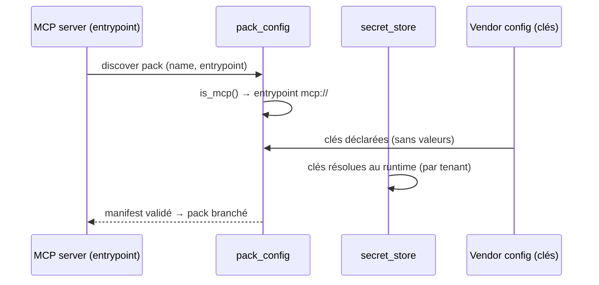

# SEC-35 — pack_config : le manifest pack.yaml (mcp://) (contexte 30)

Le contexte `pack_config` décrit l'entrée du pack MCP (`PackManifest` + `is_mcp()`)
et déclare les configs des vendors (`VendorConfig` : les clés SANS valeurs), via
`PackConfig`. Les secrets ne vivent jamais ici — ils sont résolus au runtime par
le `SecretStore`, par tenant. Le domaine reste pur : zéro import
scanner/adapter/SDK.

## Key Points

- `PackManifest` (name, entrypoint) : **`entrypoint` validé** (AC « entrypoint vide →
  ValueError », ajouté) + `name`/`entrypoint` **normalisés** ; `is_mcp()` (préfixe
  `mcp://`).
- `VendorConfig` (provider, keys) : **clés déclarées = NOMS de variables, jamais
  des valeurs** — une clé contenant `=` ou un marqueur de secret (`sk-`, `AKIA`,
  `-----BEGIN`) est **rejetée** (jamais de secret inline). C'est le **contrat**.
- `PackConfig` : consolide manifest + vendors (dédup par provider, trié),
  **`declared_keys`** (les noms de clés, sans valeurs) ; **fail-closed** : un pack
  non configuré (manifest=None) → `is_mcp()` False, état normal (pas d'échec).
- Les valeurs des clés vivent dans le `SecretStore`, jamais dans le domaine ;
  l'isolation est par `tenant` (contexte 28).
- Consommé par le MCP server (Phase 4) ; le mandat (consent) reste obligatoire.

## Test Coverage

| Fichier | Couverture de branches |
|---|---|
| `domain/pack_config/pack_manifest.py` | 100 % |
| `domain/pack_config/vendor_config.py` | 100 % |
| `domain/pack_config/pack_config.py` | 100 % |

## Related Files

- `src/hexa_sec/domain/pack_config/pack_config.py` — l'agrégat `of`
- `src/hexa_sec/domain/pack_config/pack_manifest.py` — `PackManifest` + `is_mcp()`
- `src/hexa_sec/domain/pack_config/vendor_config.py` — `VendorConfig` (clés sans valeurs)
- `src/hexa_sec/application/ports/driven/secret_store_port.py` — les clés au `SecretStore`
- `tests/unit/domain/test_pack_config.py` — scénarios de déclaration et edge cases
