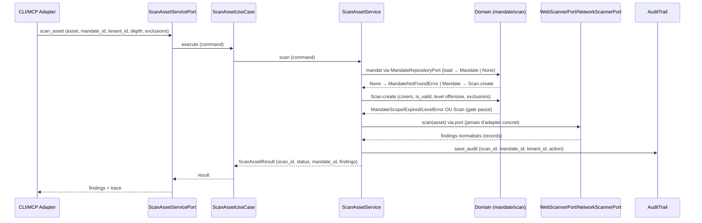

# US-1 scan_asset — lancer les scanners sur un asset (avec mandat)

Le use case `scan_asset` est le point d'entrée du pack : un asset n'est scanné que
si un **mandat** valide (loi Godfrain) couvre la cible. Le service vérifie le
mandat AVANT tout lancement, invoque les scanners injectés derrière leurs ports,
et trace le scan (scan_id → mandate_id → client) dans l'audit trail.

## Key Points

- **Gate Godfrain non-négociable** : `Scan.create()` (domaine) lève
  `MandateNotFoundError` (pas de mandat), `MandateExpiredError` (expiré),
  `MandateScopeError` (cible hors périmètre), `MandateLevelError` (profondeur
  offensive sans mandat offensive). Le service ne les attrape pas (R6).
- **`MandateRepositoryPort`** (port driven ajouté) : `load(mandate_id) ->
  Mandate | None` — fail-closed (id inconnu → `None` → `MandateNotFoundError`).
- **Command/Result étendus** : `ScanAssetCommand` (asset, mandate_id, vendor,
  tenant_id, depth, exclusions) ; `ScanAssetResult` (scan_id, status, mandate_id,
  findings). `tenant_id`/`depth`/`exclusions` nécessaires à l'isolation, au niveau
  offensif et aux exclusions.
- **Exclusions** : portées dans `ScanParameters` ; `Scan.create` refuse un asset
  exclu ; les adapters les respectent (Phase 3).
- **Zéro import d'adapter** : les scanners (web/network/code) et le mandat sont
  injectés derrière les ports (DIP). Aucun `try/catch` dans le service (R6) ; les
  `Scanner*Error` (normalisées par les adapters) propagent jusqu'au CLI/MCP.
- **Aucun scanner injecté** → `ScanConfigurationError` (HexaSecError) — pas de
  `ValueError` générique (guard R6).

## Test Coverage

| Fichier | Couverture de branches |
|---|---|
| `application/service/scan_asset_service.py` | 100 % |
| `application/use_case/scan_asset/scan_asset_use_case.py` | 100 % |
| `application/ports/driven/mandate_repository_port.py` | 100 % |
| `application/ports/driving/scan_asset/scan_asset_service_port.py` | 100 % |

## Related Files

- `src/hexa_sec/application/service/scan_asset_service.py` — l'orchestration (gate + scanners + trace)
- `src/hexa_sec/application/ports/driving/scan_asset/scan_asset_service_port.py` — command/result
- `src/hexa_sec/application/ports/driven/mandate_repository_port.py` — résolution du mandat
- `src/hexa_sec/domain/scan/scan.py` — `Scan.create` (le gate Godfrain)
- `src/hexa_sec/domain/consent/mandate.py` — `Mandate`
- `tests/unit/application/test_scan_asset_service.py` — scénarios mandat/scanners/trace
