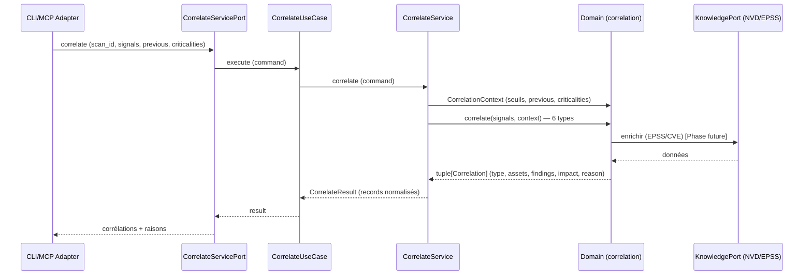

# US-2 correlate — la corrélation déterministe (LE CŒUR)

Le use case `correlate` croise les findings normalisés de plusieurs scanners sur
des assets partagés pour révéler la chaîne d'attaque, l'exposition réelle et le
bruit qu'aucun outil seul ne voit. Il est 100 % déterministe : les mêmes findings
donnent les mêmes corrélations. Le SLM n'intervient **jamais** ici — code pur,
zéro I/O.

## Key Points

- **6 types déterministes** (domaine `correlation_checker`) : attack-chain,
  exposure, noise-reduction, temporal, compliance, business-impact. C'est le
  **domaine** qui réalise la valeur (déjà implémenté + testé).
- **`CorrelateService`** est un **orchestrateur fin** : il construit le
  `CorrelationContext` (seuils, `previous`, `asset_criticalities`) depuis le
  command et appelle le domaine `correlate()`. **Zéro I/O, zéro LLM, zéro
  try/catch (R6)**.
- **Command/Result** : `CorrelateCommand` (scan_id, signals, previous,
  asset_criticalities, exposure_open_ports, noise_count) ;
  `CorrelateResult.correlations` = `list[CorrelationRecord]` (type + reason en
  langage clair + findings/preuve + impact).
- **Jamais spéculatif** : une corrélation sans finding source est rejetée dans le
  domaine (`Correlation.__post_init__`) ; une reason vide est rejetée.
- **Isolation tenant** : les `signals`/`criticalities` sont scopées par l'appelant
  (`scan_id` → tenant) ; les findings d'un autre tenant ne sont jamais croisés.
- Les adapters (CLI/MCP) passent par `correlate_handler` ; l'enrichissement
  `KnowledgePort` (EPSS/CVE) est une extension future, pas un prérequis des 6
  types.

## Test Coverage

| Fichier | Couverture de branches |
|---|---|
| `application/service/correlate_service.py` | 100 % |
| `application/ports/driving/correlate/correlate_service_port.py` | 100 % |

## Related Files

- `src/hexa_sec/application/service/correlate_service.py` — l'orchestrateur fin
- `src/hexa_sec/domain/correlation/correlation_checker.py` — les 6 détecteurs (le cœur)
- `src/hexa_sec/domain/correlation/correlation_context.py` — le contexte déterministe
- `src/hexa_sec/application/ports/driving/correlate/correlate_service_port.py` — command/result
- `tests/unit/application/test_correlate_service.py` — scénarios des 6 types
