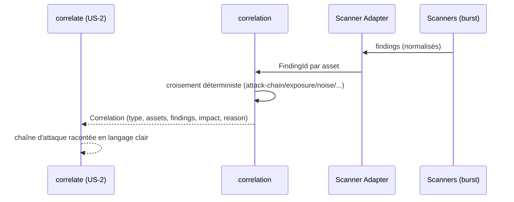

# US-2 correlate — la corrélation déterministe (LE CŒUR)

Le use case `correlate` croise les findings normalisés de plusieurs scanners
pour révéler la chaîne d'attaque, l'exposition réelle et le bruit qu'aucun
outil seul ne voit. Il est 100 % déterministe : peu importe le scanner, le
croisement produit les mêmes corrélations pour les mêmes entrées.

## Key Points

- Les scanners ne sont **jamais** connus du domaine : les adapters normalisent
  chaque sortie en `CorrelationInput` (asset, `FindingKind`, severité).
- 6 familles déterministes : attack-chain, exposure, noise-reduction, temporal,
  compliance, business-impact.
- **Aucune spéculation** : une corrélation sans finding source est rejetée.
- Aucune corrélation trouvée → tuple vide (pas un échec) ; dédup par
  `CorrelationId` (même type + même asset + mêmes findings = une seule).
- Le mandat (consent) est obligatoire : les findings corrélés proviennent d'un
  scan couvert par le périmètre.

## Test Coverage

| Fichier | Couverture de branches |
|---|---|
| `domain/correlation/correlation.py` | 100 % |
| `domain/correlation/correlation_checker.py` | 98 % (2 branches d'impact dérivées) |
| `domain/correlation/correlation_context.py` | 100 % |
| `domain/correlation/correlation_input.py` | 100 % |
| `domain/correlation/correlation_type.py` | 100 % |
| `domain/correlation/finding_kind.py` | 100 % |
| `domain/correlation/impact_score.py` | 100 % |

## Related Files

- `src/hexa_sec/domain/correlation/correlation_checker.py` — le croisement déterministe
- `src/hexa_sec/domain/correlation/correlation.py` — le VO `Correlation`
- `src/hexa_sec/domain/correlation/` — les value objects du contexte
- `tests/unit/domain/test_correlation_checker.py` — les scénarios des 6 corrélations
