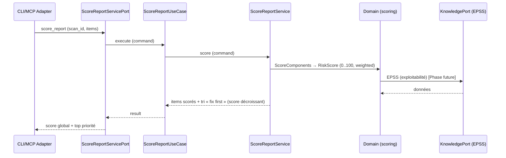

# US-3 score_report — scorer et trier « corrige CECI d'abord »

Le use case `score_report` calcule un `RiskScore` 0..100 pour chaque
finding/corrélation (sévérité × exploitabilité × exposition × impact × facilité)
et les trie par « fix first ». Il est 100 % déterministe : le SLM ne décide jamais
le score. Le domaine scoring (context 8) réalise le calcul ; le service est un
orchestrateur fin.

## Key Points

- **Score déterministe** : `compute_score(ScoreComponents)` (domaine) = moyenne
  pondérée (sévérité 0.40, exploitabilité 0.20, exposition 0.15, impact 0.15,
  facilité 0.10). `RiskScore` 0..100 + label ; bornes protégées (0/100, valeurs
  hors bornes → `ValueError`).
- **`CorrelationScore`/`ScoreReportService`** : construit `ScoreComponents` par
  item (severity → `Severity`), `compute_score` → `RiskScore`, sérialise
  (`score` int + `label`), **trie par score décroissant** (tie-break `finding_id`
  asc → **ordre stable, déterministe**), global = score max (pire posture).
- **`ScoreItem`** (finding_id, severity, exploitability, exposure, impact,
  facility) — absent (None) → renormalisé (zéro inventé) ; invalid (hors [0,1])
  → `ValueError` propagé (R6).
- **Facilité** : un fix facile (facility élevé) → priorité haute (score ↑) —
  « révoquez ce token (5 min) ».
- **Déterminisme** : même commande → même résultat (testé) ; `ordered` stable.
- **Aucune donnée** : items vides → score 0 / `low`, jamais d'échec.
- **Zéro try/catch (R6)** ; le domaine `RiskScore` garantit 0..100 + label.

## Test Coverage

| Fichier | Couverture de branches |
|---|---|
| `application/service/score_report_service.py` | 100 % |
| `application/ports/driving/score_report/score_report_service_port.py` | 100 % |

## Related Files

- `src/hexa_sec/application/service/score_report_service.py` — l'orchestrateur fin
- `src/hexa_sec/domain/scoring/scoring_engine.py` — `compute_score` (le calcul)
- `src/hexa_sec/domain/scoring/risk_score.py` — `RiskScore` (0..100 + label)
- `src/hexa_sec/domain/scoring/score_level.py` — `ScoreLevel` (bornes des labels)
- `src/hexa_sec/application/ports/driving/score_report/score_report_service_port.py` — command/result
- `tests/unit/application/test_score_report_service.py` — scénarios de scoring et tris
