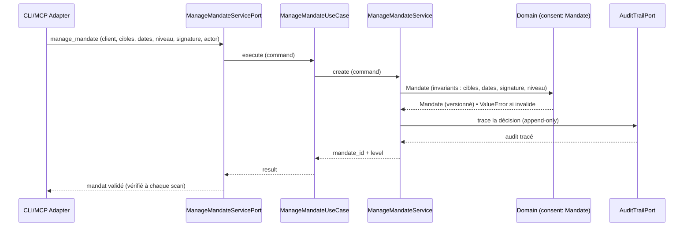

# US-4 manage_mandate — le consentement légal (obligatoire avant tout scan)

Le use case `manage_mandate` crée et trace le **mandat légal** (loi Godfrain) :
client, cibles, dates, niveau et signature. `scan_asset` (US-1) refuse tout scan
sans mandat valide. Le mandat est **versionné** (création = objet immuable, jamais
muté) et chaque décision de consentement est tracée dans l'audit trail (append-only).

## Key Points

- **Mandate (domaine)** : `mandate_id`, client, targets, start/end_date, level,
  signature — invariants protégés (targets non vides, end >= start, signature +
  client non vides). `covers(target)`, `is_valid(as_of)`, `is_offensive()`.
- **`ManageMandateService`** : construit le `Mandate` (id généré `mnd_<uuid>`),
  **trace** la décision (`AuditRecord` action="consent", actor, tenant, mandate_id)
  via l'audit trail — **append-only, jamais muté**. Zéro try/catch (R6) : les
  invariants du domaine lèvent `ValueError` qui propagent.
- **Command/Result** : `ManageMandateCommand` (client, targets, start_date,
  end_date, level, **signature, actor, tenant_id**) ; `ManageMandateResult`
  (mandate_id, level).
- **Versionné** : `create` retourne un `Mandate` immuable ; toute modification est
  une **nouvelle version** (jamais mutation) — `scan_asset` (US-1) référence le
  `mandate_id`, et `load()` le résout pour le gate.
- **Isolation tenant** : `tenant_id` est porté sur le trace d'audit ; le mandat est
  scopé au client.
- **Le refus offensif** (`MandateLevelError`) n'est pas déclenché à la création —
  il l'est au **scan** (`Scan.create`), quand la profondeur demandée est offensif
  sans mandat `offensive`.

## Test Coverage

| Fichier | Couverture de branches |
|---|---|
| `application/service/manage_mandate_service.py` | 100 % |
| `application/ports/driving/manage_mandate/manage_mandate_service_port.py` | 100 % |
| `application/use_case/manage_mandate/manage_mandate_use_case.py` | 100 % |

## Related Files

- `src/hexa_sec/application/service/manage_mandate_service.py` — l'orchestration du consent
- `src/hexa_sec/domain/consent/mandate.py` — `Mandate` (le verrou Godfrain)
- `src/hexa_sec/domain/consent/audit_consent.py` — le log de consent (append-only)
- `src/hexa_sec/application/ports/driven/audit_trail_port.py` — trace (append-only)
- `src/hexa_sec/application/use_case/scan_asset/scan_asset_service.py` — vérifie le mandat (US-1)
- `tests/unit/application/test_manage_mandate_service.py` — création, rejets, trace
