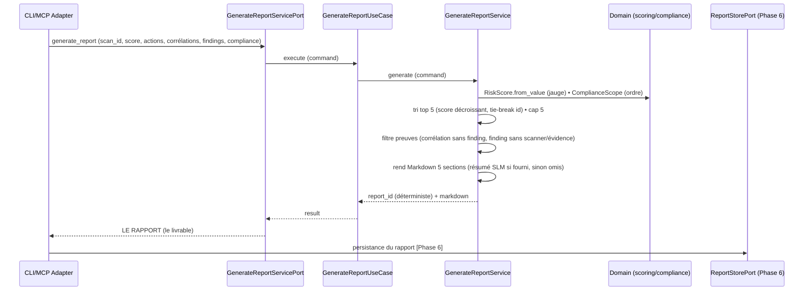

# US-5 generate_report — le rapport final (score + top 5 + résumé)

Le use case `generate_report` assemble **LE rapport**, le livrable vendu : 5
sections dans l'ordre canonique — 1) score global (jauge + évolution), 2) top 5
« fix first », 3) corrélations en langage clair, 4) détail technique (preuves),
5) conformité (ISO/RGPD/NIS2/PCI-DSS). Le cœur est **100 % déterministe** : le
SLM ne rédige que le premier paragraphe (page 1) et ne décide jamais le score.
Pas de rapport sans preuve : chaque finding du détail cite son scanner + son
évidence, toute corrélation sans finding source est rejetée.

## Key Points

- **5 sections dans l'ordre** : `## 1. Score global` → `## 2. Top 5 « fix
  first »` → `## 3. Corrélations` → `## 4. Détail technique` → `## 5.
  Conformité` — ordre vérifié par test (`_headings`).
- **Command porteur** (comme US-2/US-3) : `GenerateReportCommand` transporte les
  données typées (score, previous_score, ai_summary, actions, correlations,
  findings, compliance) — aucune persistance requise à ce stade.
- **Top 5 « fix first »** : tri déterministe par score décroissant (tie-break
  `finding_id` asc) puis **cap à 5** — jamais d'invention, jamais de 6e item.
- **Preuves obligatoires** : corrélation sans `findings` → exclue ; finding sans
  `scanner` ou sans `evidence` → exclu du détail technique (pas de rapport sans
  preuve). Les sections vides sont rendues (« Aucun finding… »), pas un échec.
- **Résumé SLM** : champ `ai_summary` optionnel de la Command — vide → résumé
  omis, le rapport reste valide ; le SLM explique, il ne décide pas le score.
- **Déterminisme / idempotence** : `report_id = rep_<scan_id>` → le même scan
  produit toujours le même rapport ; même command → même markdown (testé).
- **Score hors bornes** → `ValueError` (`RiskScore` 0..100) ; scope de conformité
  inconnu → `ValueError` (`ComplianceScope`). Zéro try/catch (R6).

## Test Coverage

| Fichier | Couverture de branches |
|---|---|
| `application/service/generate_report_service.py` | 100 % |
| `application/ports/driving/generate_report/generate_report_service_port.py` | 100 % |
| `application/use_case/generate_report/generate_report_use_case.py` | 100 % |

## Related Files

- `src/hexa_sec/application/service/generate_report_service.py` — l'assemblage déterministe 5 sections
- `src/hexa_sec/application/ports/driving/generate_report/generate_report_service_port.py` — command/result + records
- `src/hexa_sec/application/use_case/generate_report/generate_report_use_case.py` — l'entrée applicative
- `src/hexa_sec/domain/scoring/risk_score.py` — `RiskScore` (jauge 0..100 + label)
- `src/hexa_sec/domain/compliance/compliance_scope.py` — l'ordre ISO/RGPD/NIS2/PCI-DSS
- `tests/unit/application/test_generate_report_service.py` — scénarios des 5 sections, tri, preuves, déterminisme
